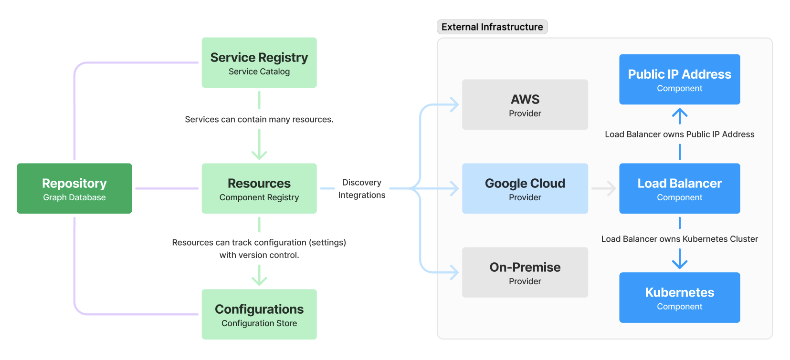

# What is infraregistry?

<figure><figcaption></figcaption></figure>

[<mark style="color:purple;">infraregistry</mark>](https://infraregistry.com) is a self-service platform that enables you to catalog, track, and manage your services and resources.

<figure><figcaption></figcaption></figure>

## Components

The following components make up Infraregistry.

### Service Catalog

Centralized repository of services, including configurations and relationships such as a products REST API, web interface, or offering providing users and tools the ability to easily discover resources operating within an organization.

### CMDB

Configuration data and change tracking for infrastructure components such as values for things like network IP addresses or settings for applications.


Use the CMDB to keep an audit log of your resources to detect and report on changes.


###
